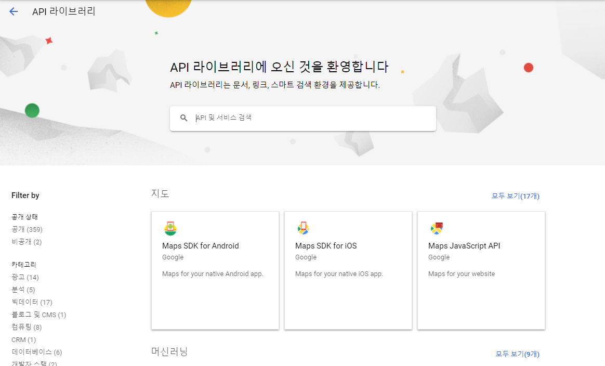
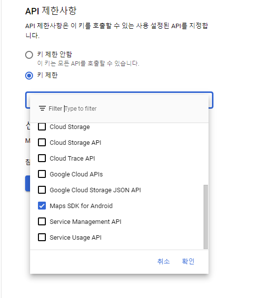
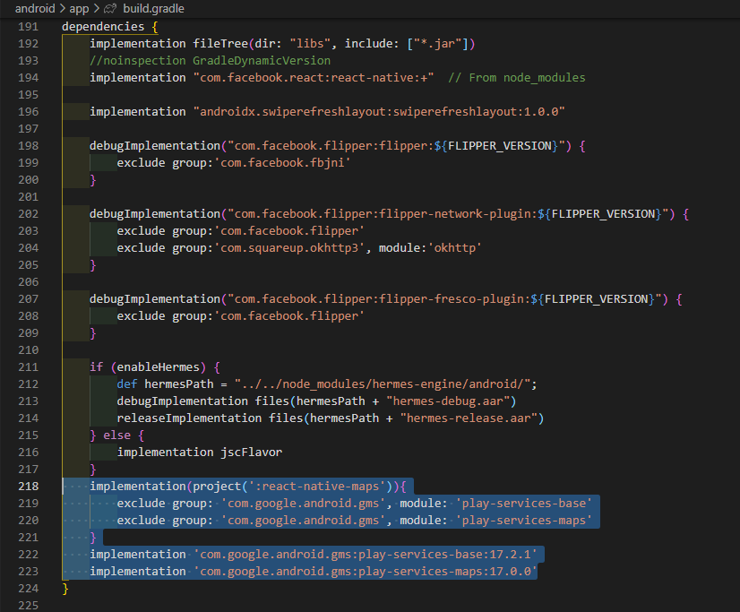

오늘 구글 클라우드 플렛폼 API를 이용하여
React-native-map을 구현해 볼 것이다.

공식문서:["React-Native-Maps Link"](https://github.com/react-native-maps/react-native-maps)

#### google cloude flatform에서 API키 가져오기

Google Cloud Platform Link:["Google Cloud Platform"](https://console.cloud.google.com/home/dashboard?project=map-rn-329104&organizationId=384916252399)


1. API 및 서비스 > 사용자 인증 정보


2. API 키 만들기



3. 라이브러리 > Maps SDK for Android 사용



4. API 및 서비스 > 사용자 인증 정보 > 아까 만들어 놓은 키


#### react-native-maps 설치
``` $ npm install react-native-maps```


이제 공식문서를 보면서 의존성만 주입해주면 된다.

#### android > build.gradle


#### android > app > build.gradle


#### android > app > src > main > AndroidManifest.xml
