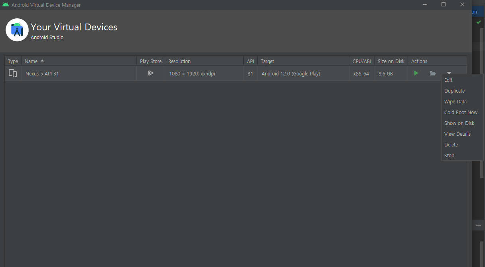

## Causes
1. 설치 경로에 영어가 아닌 한국어가 적혀있어서
2. 디스크 공간이 부족해서
3. 실행에 필요한 프로그램이 깔려있지 않아서

 

1번과 2번의 경우는 위의 Device Manager에서 원인을 알아볼 수 있다. 
1번은 View Details에 들어가서 한국어나 영어가 아닌 다른 경로로 저장되어 있다면 
환경변수를 설정해준다. 

 

1. 윈도우키 > 시스템 속성 > 고급 > 환경 변수
2. 사용자 변수에 4개의 변수를 새로 추가하면 된다. 값은 안드로이드 스튜디오가 설치되어 있는 경로로 하면 된다.

 

ANDROID_AVD_HOME 
ANDROID_SDK_HOME 
ANDROID_SDK_ROOT 
ANDROID_HOME 

 

2번은 Show on Disk에 들어가서 파일의 개수를 본다. 
파일이 많다면 그들을 삭제하고 다시 에뮬레이터를 깔아주면 된다. 
만약 실행중이어서 지워지지 않는다면 실행을 끄거나 재부팅 후에 삭제해주면 된다. 

 

3번의 경우엔 SDK Manager > SDK tools에 들어가서  
Android Emulator,  
Android SDK Platform Tools,  
Intel x86 Emulator Accelerator(HAXM Installer) 
등 필요한 프로그램이 안깔려 있으면 최신 버전으로 깔아주면 된다. 